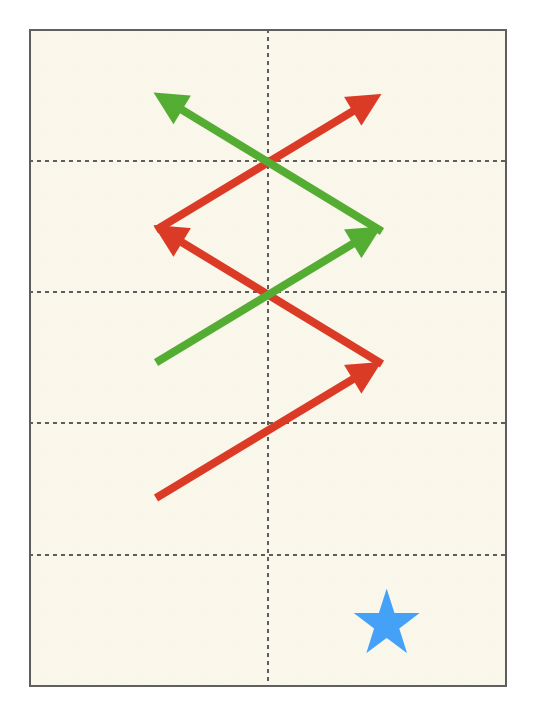

# 문제
어떤 동물원에 가로로 두칸 세로로 N칸인 아래와 같은 우리가 있다.

|   |   |
|---|---|
|   |   |
|   |   |
| : | : |

이 동물원에는 사자들이 살고 있는데 사자들을 우리에 가둘 때, 가로로도 세로로도 붙어 있게 배치할 수는 없다. 이 동물원 조련사는 사자들의 배치 문제 때문에 골머리를 앓고 있다.

동물원 조련사의 머리가 아프지 않도록 우리가 2*N 배열에 사자를 배치하는 경우의 수가 몇 가지인지를 알아내는 프로그램을 작성해 주도록 하자. 사자를 한 마리도 배치하지 않는 경우도 하나의 경우의 수로 친다고 가정한다. [baekjoon](https://www.acmicpc.net/problem/1309)

<br>

# 코드
```java
import java.io.BufferedReader;
import java.io.IOException;
import java.io.InputStreamReader;
import java.math.BigInteger;

public class 동물원_1309 {
    public static void main(String[] args) throws IOException {
        BufferedReader br = new BufferedReader(new InputStreamReader(System.in));
        int n = Integer.parseInt(br.readLine());
        br.close();

        BigInteger[][] dp = new BigInteger[n + 1][2];
        dp[1][0] = new BigInteger("2");
        dp[1][1] = new BigInteger("2");
        dp[0][0] = BigInteger.ONE;
        dp[0][1] = BigInteger.ONE;

        for (int i = 2; i <= n; i++) {
            dp[i][0] = new BigInteger("2").multiply(dp[i - 1][1]).add(dp[i - 2][1]).subtract(BigInteger.ONE).mod(new BigInteger("9901"));
            dp[i][1] = new BigInteger("2").multiply(dp[i - 1][0]).add(dp[i - 2][0]).subtract(BigInteger.ONE).mod(new BigInteger("9901"));
        }
        System.out.println(dp[n][0].add(dp[n][1]).subtract(BigInteger.ONE).mod(new BigInteger("9901")));
    }
}
```

<br>

# 풀이
dp[n][0]에는 n번째 줄의 왼쪽칸까지 봤을 때 사자를 넣는 경우의 수를, dp[n][1]에는 오른칸까지 봤을 때 사자를 넣는 경우의 수를 담았다. 해결한 방법은 다음과 같다.



빨간선으로 표시한 부분이 dp[i - 1][1] * 2에 해당한다. 2배를 해준 이유는 현재 값을 구하는 위치(별 모양으로 표시)에 사자가 들어가는 경우의 수 + 사자가 들어가지 않는 경우의 수를 모두 포함할 수 있기 때문이다.  
초록선으로 표시한 부분은 dp[i - 2][1]에 해당한다. 여기서는 초록색이 처음 시작하는 위치에 사자가 있지 않은 케이스는 모두 중복이 되버리기 때문에 2를 곱하지 않는다. 이렇게 2가지 케이스로 구분하게 되면 서로 다른 부분들에 대해 모든 경우의 수를 다를 수 있다. 그 후 사자를 1마리도 넣지 않는 케이스가 계속해서 중복이 되기 때문에 아예 왼쪽 오른쪽 모두에서 빼버렸다. 마지막에 결과를 출력할 때 1을 더해주는 이유가 이것이다.  
점화식 찾느라 토할뻔했는데 다른 사람들 풀이를 보니까 내가 너무 어렵게 생각했던 것 같다ㅜㅜ 가장 최적화된 구조식을 찾는 연습이 더 필요할 것 같다.
